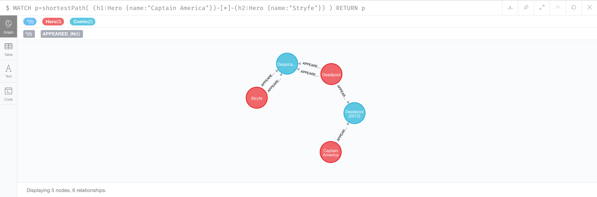

# Marvel Heroes Network

L'objectif de cet exercice est d'analyser les liens entre Heroes et Comics Marvel grâce à la base graphe Neo4J.

## TODO

* Créer le graphe des Heroes dans Neo4J, à partir des données disponibles dans le dossier `data`. Les noeuds du graphe sont soit des Heroes, soit des Comics.
* Répondez à la question suivante : existe-t-il un Hero qui connait deux Heros différents qui eux-mêmes ne se connaissent pas ? (un Hero connait un autre Hero s'il apparaissent dans un même Comic)

## Liens utiles

* Import Tool Neo4J : https://neo4j.com/docs/operations-manual/current/tutorial/import-tool/

## Premiers éléments de solution

Il est d'abord nécessaire de préparer correctement les fichiers CSV afin de pouvoir les importer avec l'`import-tool`.

Pour cela, 3 scripts de préparation des CSV peuvent être utilisés : 

```
yarn install
mkdir dist
node prepare-heroes.js > dist/heroes.csv
node prepare-comics.js > dist/comics.csv
node prepare-comics-heroes.js > dist/comics-heroes.csv
```

Ces scripts permettent notamment : 
* De créer des entêtes CSV adéquates pour l'`import-tool` de Neo4J
* De formatter correctement les valeurs des colonnes
* De supprimer les doublons (il y en a dans `comics.csv` notamment)


L'import peut donc maintenant se faire correctement avec les fichiers "préparés" : 

```
neo4j-admin import --nodes=./dist/heroes.csv --nodes=./dist/comics.csv --relationships=./dist/comics-heroes.csv
```

Le résultat de l'import devrait être le suivant : 
```
IMPORT DONE in 3s 946ms.
Imported:
  40045 nodes
  75257 relationships
  80090 properties
```

Pour répondre à la question "Existe-t-il un Hero qui connait deux Heros différents qui eux-mêmes ne se connaissent pas ?", un algorithme de type "recommandation" est adatpté.

Voici un exemple de requête permettant de répondre à la question : 

```
MATCH (hero:Hero)-[:APPEARED_IN]->(c1:Comic)<-[:APPEARED_IN]-(coHero:Hero),
  (coHero)-[:APPEARED_IN]->(c2:Comic)<-[:APPEARED_IN]-(cocoHero)
WHERE NOT (hero)-[:APPEARED_IN]->()<-[:APPEARED_IN]-(cocoHero) AND hero <> cocoHero
RETURN DISTINCT hero.name, c1.title, coHero.name, c2.title, cocoHero.name
LIMIT 10
```

Et voici le résultat : 

| `hero.name`     | `c1.title`                  | `coHero.name` | `c2.title`                                          | `cocoHero.name` |
| --------------- | --------------------------- | ------------- | --------------------------------------------------- | --------------- | 
| Captain America | Cable and X-Force (2012) #9 | X-Force       | Cable & X-Force: Onslaught Rising (Trade Paperback) | Risque          |
| Captain America | Cable and X-Force (2012) #9 | X-Force       | Cable & X-Force: Onslaught Rising (Trade Paperback) | Hellfire Club   |
| Captain America | Cable and X-Force (2012) #9 | X-Force       | X-Force (1991) #1                                   | Wildside        |
| Captain America | Cable and X-Force (2012) #9 | X-Force       | X-Force (1991) #1                                   | Stryfe          |
| Captain America | Cable and X-Force (2012) #9 | X-Force       | X-Force (1991) #1                                   | Forearm         |
| Captain America | Cable and X-Force (2012) #9 | X-Force       | X-Force (1991) #1                                   | Feral           |
| Captain America | Cable and X-Force (2012) #9 | X-Force       | X-Force (1991) #1                                   | Boomer          |
| Captain America | Cable and X-Force (2012) #9 | X-Force       | X-Force (1991) #1                                   | Black Tom       |
| Captain America | Cable and X-Force (2012) #9 | X-Force       | X-Force (1991) #2                                   | Feral           |
| Captain America | Cable and X-Force (2012) #9 | X-Force       | X-Force (1991) #2                                   | Boomer          |

On peut vérifier les liens entre les héros avec un algorithme de calcul de plus cours chemin, par exemple : 

```
MATCH p=shortestPath(
(h1:Hero {name:"Captain America"})-[*:APPEARED_IN]-(h2:Hero {name:"Stryfe"})
)
RETURN p
```

